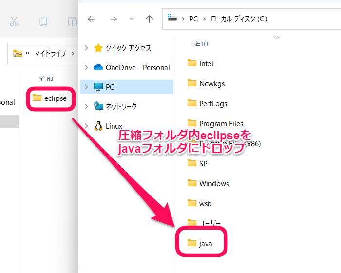
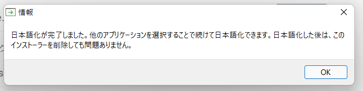
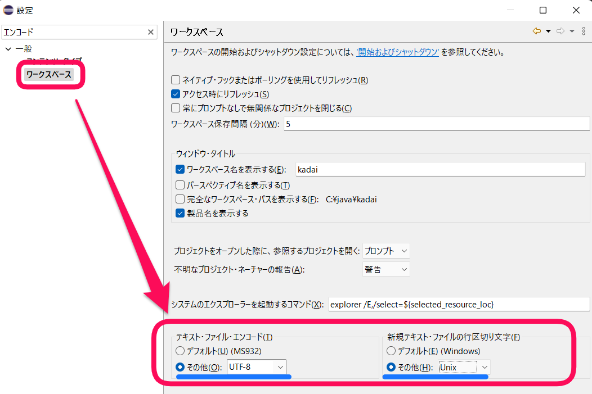
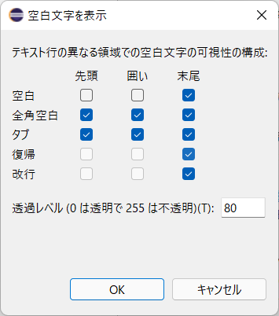

... _eclipse:

カスタムEclipseの作成
#####################

ベース部分(Eclipse本体)
***********************

Java絡みで使われることの多い `Eclipse <https://www.eclipse.org/>`_ ですが、導入自体はそれほど難しくありません。

1. `Eclipse <https://www.eclipse.org>`_ に行く      
2. 右上のダウンロード(Downloads)ボタンをクリック

    .. figure:: images/eclipse-install-01.png
        :scale: 65%
        :align: center
        :target: https://www.eclipse.org/

        ダウンロードボタンの場所

3. "Get Eclipse IDE 2022‑03" など、最新版のEclipseのダウンロード用ボタンではなく、その下にある :menuselection:`Download Packages` をクリック 

    .. figure:: images/eclipse-install-02.png
        :scale: 65%
        :align: center

        いかにもなボタンは押さない

4. :menuselection:`Eclipse IDE for Java Developers`  を選ぶ

    .. figure:: images/eclipse-install-03.png
        :scale: 65%
        :align: center
    
        ダウンロードするべきものを選ぶ

5. 自分のOSとアーキテクチャを選んでダウンロードへ移動、Windowsであれば、Windowsの :menuselection:`x86_64` を選べばよい 

    .. figure:: images/eclipse-install-04.png
        :scale: 65%
        :align: center
    
        OS/アーキテクチャの選択

6. ダウンロードしたファイル(Windows版ならzip形式)を適当な場所に展開する

なお展開ですが、配布zipファイルでは、eclipseフォルダを内包しているため、授業環境(教科書)に適合させるのであれば、

1. Cドライブ直下に :file:`java` フォルダを作る
2. zipファイル中の :file:`eclipse` フォルダを 1.の `java` フォルダ内に展開する

となります。

    ファイルの展開(:file:`C:/java` 以下)

日本語化
********

MergeDocプロジェクトへ行き、日本語化ツールの最新版を取得します。

1. `MergeDoc Project <https://mergedoc.osdn.jp/>`_ に行きます
2. "Pleiades プラグイン・ダウンロード" で利用する(Eclipseを入れた)OSを選んでインストーラーをダウンロードします

    .. figure:: images/eclipse-install-06.png
        :width: 75%

        インストーラーの選択

3. ダウンロードしたzipを展開し、中にある :command:`setup.exe` を実行してください、
   日本語化したいファイルとして、 :file:`C:/java/eclipse/eclipse.exe` を選び、日本語化開始のボタンをおしてください 

    .. figure:: images/eclipse-install-07.png
        :width: 75%

        セットアップの画面

    .. figure:: images/eclipse-install-08.png
        :width: 75%

        eclipseを選択したところ(各項目にパスが入る)

日本語化されれば、ウィンドウを閉じていき、 :command:`Eclipse` を起動してあげましょう。 

    セットアップ完了

.. note::

    なお、初回～数回起動する間は、日本語化に絡む内部キャッシュなどの生成が裏で行われるため、
    若干低速化するようです。諦めてください。

設定の変更
**********

起動したら、Eclipseの設定を適宜書き換えていきます。

- JREの追加(:menuselection:`Java-->インストール済みのJRE`)はここでは変更しません(利用するときにJDK/JREをその時のもので設定するため)
- :menuselection:`一般-->ワークスペース-->テキスト・ファイル・エンコード` をデフォルトではなく『その他』側でUTF-8に設定
- 同じく :menuselection:`新規テキスト・ファイルの行区切り文字` を『その他』側でUNIXに設定
    - 実はこれはしなくてもいいのですが、開発ではいろんなOSを跨いでの作業もあったりします。
    - そのため、LFのみ(UNIXベース)に揃えておくことで不揃いな状況を回避できます。

    エンコーディングと区切り文字の設定

- :menuselection:`一般-->エディター-->テキスト・エディター` にて
  - :menuselection:`タブでスペースを挿入` を有効化
  - :menuselection:`backspace/deleteで複数のスペースを除去` を有効化
  - :menuselection:`空白文字を表示` を有効化し、 :menuselection:`可視化の構成` にて以下の形で設定(適宜後で変更してかまいません)
    - 空白は『末尾』のみ有効にする
    - 全角空白は全て有効にする(本来、存在してはいけない文字)
    - タブは全て有効にする
    - 復帰・改行は『末尾』のみ有効にする

    空白文字の設定例(上記基準に準拠)

空白文字はうっかり含めるとエンジニアを殺す効果があります。
気づきにくいので入れないようにする必要があります。

さしあたりこれだけで十分です。