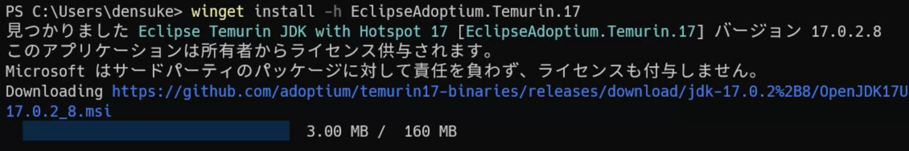

.. _java:

======================================================
Javaの開発環境(JDK)
======================================================

TL;DR
=================================================

- :command:`winget` にて :code:`jdk` を検索してみるとよい
- 2022年3月時点でのLTSは17なので、バージョン17のJDKを選べば良い
- ビルドはいろいろあるので、適当に選べば良い

JDKについて
===============================

Java開発キット(JDK; Java Development Kit)は、古はSun MicrosystemsやOracleが公開していましたが、
仕様そのものは OpenJDK というプロジェクトにより公開されています。
そのため、別のメーカーでも、仕様の互換性が確認できれば使えたりします。

現状では、OpenJDKに基づく仕様のリファレンスビルド(参照ビルド)としてのOpenJDKが公開されていますが、
実際のバイナリはいろんなところから配布されています。

- ある意味本家となるOracle版ビルド、無償・有償の扱いで悩むことがありましたがJDK17(JRE17)からは無償でも問題無く利用できるライセンスになりました
- 少し前までAdoptOpenJDKと言われていたビルドはEclipsAdoptiumというブランドに変更されています
- MicrosoftもWindows環境やAzure上での動作を念頭に置いたJDKとして"Microsoft build of"版が存在します

ということで、 :ref:`winget` を参照して  :command:`winget` が入っていれば簡単です。
管理者のPowerShell端末を開いて確認してみましょう。

.. code-block::
    :caption: wingetで検索

    PS> winget search jdk
    名前                                       ID                            バージョン    一致         ソース
    ----------------------------------------------------------------------------------------------------------
    Java SE Development Kit 17                 Oracle.JDK.17                 17.0.2.0      Tag: jdk     winget
    OpenWebStart                               karakun.OpenWebStart          1.5.2         Tag: jdk     winget
    Eclipse Temurin JDK with Hotspot 8         EclipseAdoptium.Temurin.8     8.0.322.6     Tag: jdk     winget
    Eclipse Temurin JDK with Hotspot 17        EclipseAdoptium.Temurin.17    17.0.2.8      Tag: jdk     winget
    ...(以下略)

結局どれを入れよう…
===================================

ここではEclipse版を使ってみたいと思います。
なおバージョン的には現行LTSである17のものとするため、 `EclipseAdoptium.Temurin.17` を使うことにします。

.. code-block::
    :caption: JDK17のインストール

    PS> winget install -h EclipseAdoptium.Temurin.17

    JDK17(Adoptium版)のインストール中の様子

インストール後、情報を確認しておきます。
別の一般ユーザーのターミナル(端末)を開いて確認します。

.. code-block::
    :caption: JDKのインストール確認

    PS> Get-Command java
    CommandType     Name                  Version    Source
    -----------     ----                  -------    ------
    Application     java.exe              17.0.2.0   C:\Program Files\Eclipse Adoptium\jdk-...

と、Javaコマンドが呼び出せるようになっていればOKです。
バージョンも17.0.2.0と出ているので問題無いでしょう。

もし複数のJavaが入っている場合、混乱することがありますので、依存しているアプリがないのであれば、古いバージョンはアンインストールしても良いでしょう。
ただしEclipseの中で参照していることがあるので、Eclipseの設定 :guilabel:`インストール済みのJRE` のチェックと更新はしておいてください。