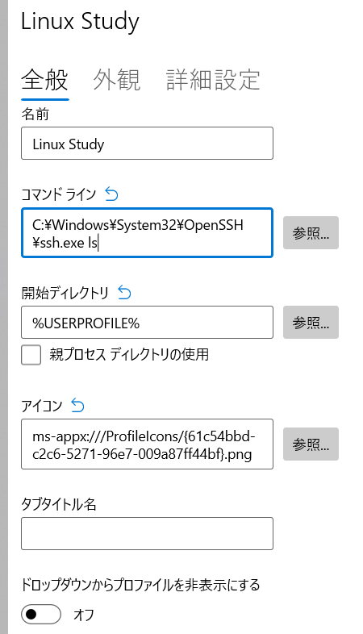

.. _winterm-ssh:

=========================================================
Windows Terminalとsshの利用
=========================================================

Windows上でLinux(UNIX一般でも)へ繋ぐときの端末は、長らく `TeraTerm <>https://ja.osdn.net/projects/ttssh2/`_ や
`PuTTY <https://www.chiark.greenend.org.uk/~sgtatham/putty/index.html>`_  、`RLogin <https://github.com/kmiya-culti/RLogin>`_ などがありましたが、
Microsoft自身が従来のコマンドプロンプトなどで使っていた端末を現代的に作り直した **Windows Terminal** が通常利用ではそれほど困らずに端末としての機能を使えるようになっています。
ここでは余計なことをせずに使えるので、Windows Terminalを使っての接続を紹介します。

.. note::

    PuTTYはオリジナル版でも概ね使えていますが、日本語への対応度をより上げているバージョンが諸処の事情からか派生版がいっぱい出ています。

    - ごった煮版
    - iceiv版
    - ranvis版 その他あるかもしれません

    興味ある方はPuTTYと各派生版の名前で検索してみてください

また、sshの部分はMicrosoftがOpenSSHを移植する形でクライアント(:command:`ssh` )は標準で入っているのでこれを使えば余計な準備が不要となります。

Windows Terminalの導入
==========================================

Windows11
---------

Windows11では標準でインストールされているので特に対応は不要です。
せいぜい `ストアで更新しておく <https://www.microsoft.com/ja-jp/p/windows-terminal/9n0dx20hk701#activetab=pivot:overviewtab>`_ ぐらいはしてもいいでしょう。

Windows10
---------

Windows10では標準では入っていないため、インストールする必要があります。
入れ方はいろいろあります。

ストアから
^^^^^^^^^^

`ストアで表示して <https://www.microsoft.com/ja-jp/p/windows-terminal/9n0dx20hk701#activetab=pivot:overviewtab>`_  インストールしてください。

wingetで【おすすめ】
^^^^^^^^^^^^^^^^^^^^

:ref:`winget <winget>` が入っているなら、管理者のプロンプトを開き、インストールしてみると良いでしょう。

.. code-block::
    :caption: wingetでのWindows Terminalインストール例

    PS> winget install -h 9N0DX20HK701 # ストアのIDのためよくわからん16進数列です

githubから
^^^^^^^^^^

開発リポジトリがgithub上で公開されています。

- `Github: Windows Terminal <https://github.com/microsoft/terminal>`_

こちらの `リリース一覧 <https://github.com/microsoft/terminal/releases>`_ から最新のものを入れれば良いでしょう。
ただし更新の自動化が行われない可能性もあるので、適宜確認しておくと良いと思います。

sshによる接続
=============

端末(Windows Terminal)を起動し、 :command:`ssh` で繋いでみましょう。

.. code-block:: 
    :caption: sshでの接続

    PS> ssh 接続先ホスト名

ただし、接続時のユーザー名は **Windows側のログインユーザー名** がデフォルトとなってしまうため、違うのであれば明示する必要があります。

.. code-block:: 
    :caption: sshでの接続(ユーザー指定)

    PS> ssh ユーザー名@接続先ホスト名
    # ユーザー名を -l オプションで渡すこともできます
    PS> ssh -l ユーザー名 接続先ホスト名

通常sshは22/tcpを利用しますが、学校で配布している仮想マシンへの接続など、ポート番号が異なる時は、ポート番号を :command:`-p PORT` で設定する必要があります。

.. code-block:: 
    :caption: sshでの接続(ユーザー指定、ポート指定)

    PS> ssh -p ポート番号 ユーザー名@接続先ホスト名 
    PS> ssh -l ユーザー名 -p ポート番号 接続先ホスト名

これらを踏まえたとき、学校配布の仮想マシン(VM)に接続するときは以下のコマンドラインとなります。

- 接続先はWindowsホスト上のVMのため、自分自身(localhost)
- 接続するユーザーは :code:`linux`
- 接続するポート番号は 2022

.. code-block:: 
    :caption: sshでの接続例(授業配布VM)

    PS> ssh -p 2022 linux@localhost
    # もしくは
    PS> ssh -p 2022 -l linux localhost

:file:`config` で少し手軽に
===========================

sshの接続時コマンドラインは少々複雑になるので、普段使いのものは設定に入れておく方が楽できます。
そこで、 :file:`~/.ssh/Config` を準備しておくといいでしょう。

.. code-block:: 

    PS> mkdir ~/.ssh # 下の注釈参照
    PS> cd ~/.ssh
    PS> notepad Config #さしあたりメモ帳でさっと記入

.. note::
    何らかの理由で既に用意されていることもあります。その場合は気にせず :command:`cd` してください。

    PS> mkdir ~/.ssh
    mkdir : 指定された名前 C:\Users\densuke\.ssh の項目は既に存在します。

.. code-block:: 
    :caption: ~/.ssh/Configの記述例(大文字小文字を区別します)

    Host ls
        HostName localhost
        Port 2022
        User linux
        RequestTTY yes

この例では、短縮名ls(Linux Study)としていますが、適当な名称にしてもOKです(ただし適宜読み替えてください)。

HostName
    接続先ホスト名
Port
    22/tcp以外の非標準ポートを使うときの番号
User
    接続先のユーザー名
RequestTTY
    端末制御の利用を求める(:command:`vi` などが利用)

.. note::

    メモ帳(:command:`notepad`) を使ったとき、新規で生成されるファイル名に暗黙で拡張子 `.txt` を付けられてしまうことがあるので、メモ帳終了後にファイル名を確認しておきましょう。

    .. code-block:: 
    
        PS> notepad Config  # Configファイルを作成
        # 以下はメモ帳終了後に
        PS> ls
        # ファイル名が "Config.txt" になっていないかチェック、もしなっていたら修正
        PS> Rename-Item Config.txt Config
        PS> ls
        # ファイル名の変更をチェック

以上の設定により、

.. code-block:: 

    PS> ssh ls

で接続できるようになります。

おまけ: プロファイルの追加
==========================

Windows Terminalでは、開くタブ(ウィンドウ)で実行するべきコマンドをプロファイルという形で登録できます。
:command:`ssh` を使う形で記述する場合、以下の設定をプロファイルとして追加すれば該当プロファイルを開くだけで接続を試みるようになります。

名前
    お好みで
コマンドライン
    :code:`C:\Windows\System32\OpenSSH\ssh.exe ls` 
    (lsのところは自分で設定した短縮名)
開始ディレクトリ
    :code:`%USERPROFILE%` (たぶん初期値)
アイコン
    適当に設定してください(画面例はPowerShellのものをコピー)
タブタイトル名
    設定不要(してもいいけどどうなるかよくわかりません)

    プロファイル設定例